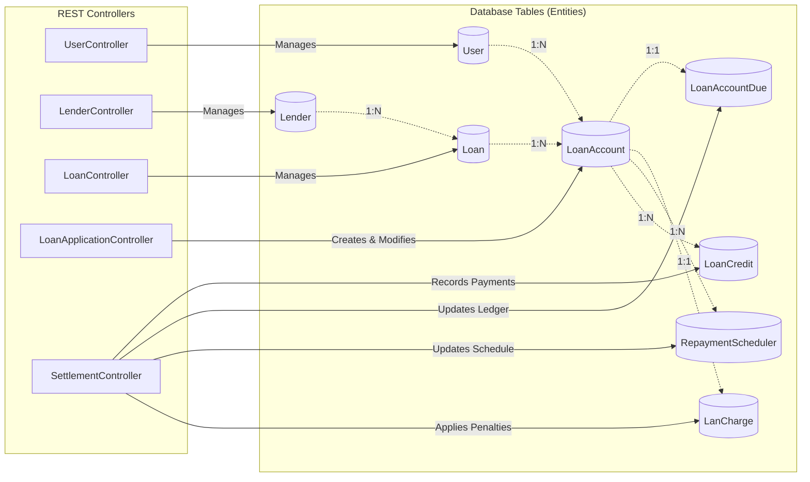
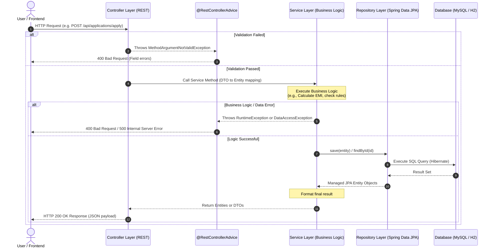
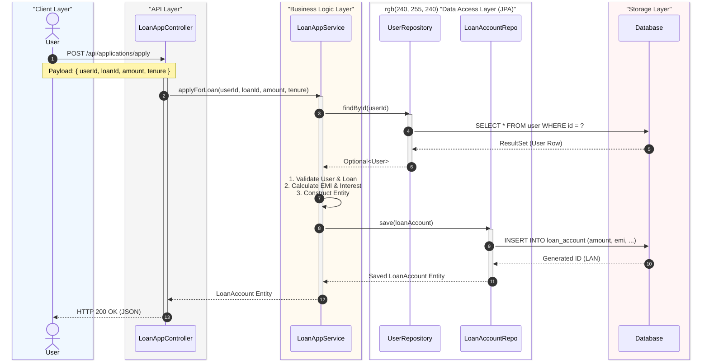
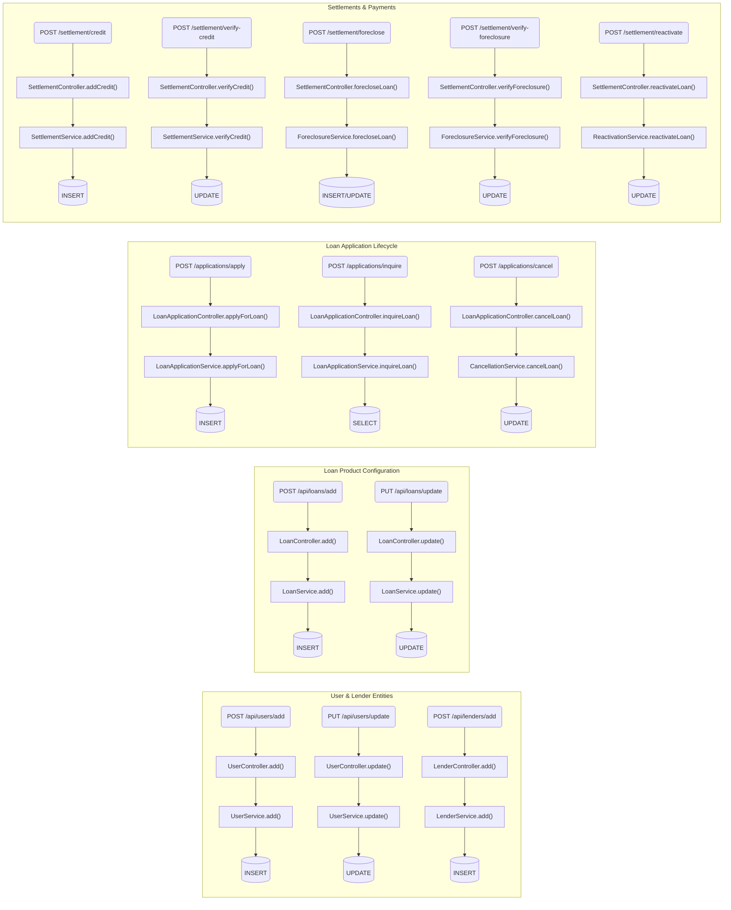
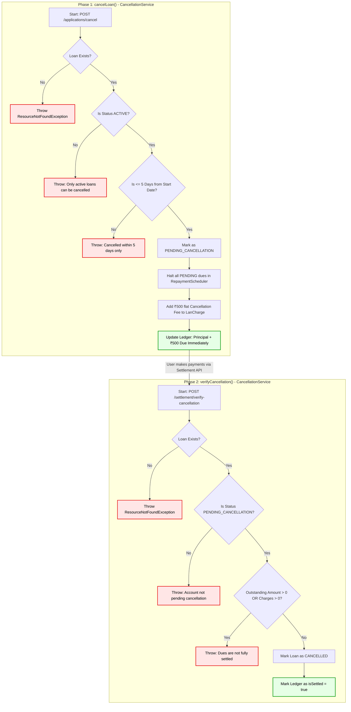
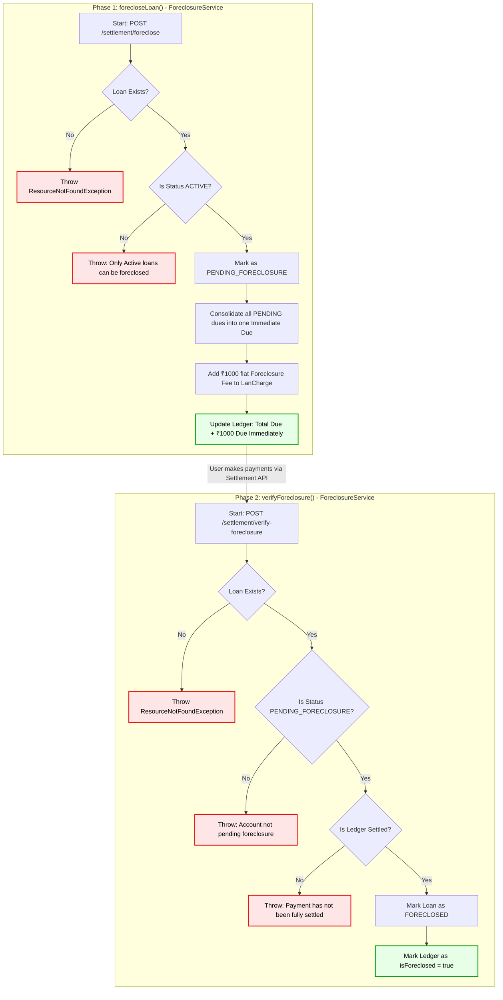
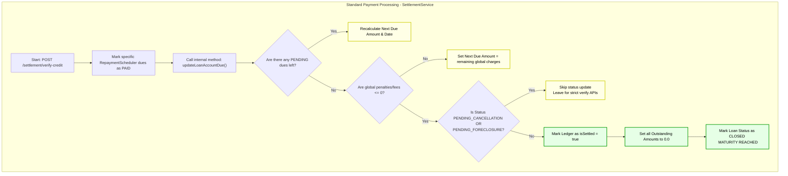
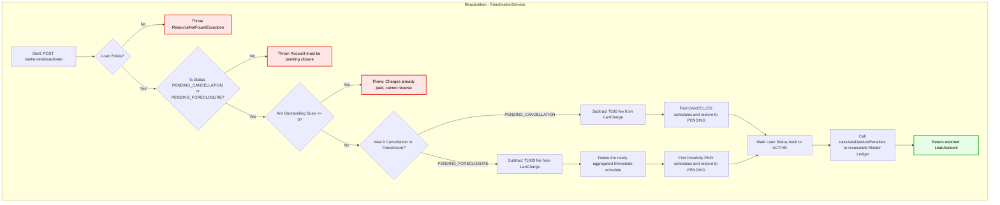

# System Architecture and Flow Charts

Here is the high-level overview of the LMS project's architecture, API surface, and database structure.

## 1. High-Level Entity & Controller Flow
This diagram illustrates the core REST Controllers exposed to clients, the database tables they manage, and the relational structure (1:N, 1:1) between those tables.

## 2. Layered Application Architecture
This sequence diagram shows how data flows vertically through the different layers of the Spring Boot application—from the client all the way to the database.

## 3. Explicit Function Call Chain (Example: Apply for Loan)
This sequence diagram illustrates a concrete example of how a specific API request cascades through the exact methods and functions in each architectural layer, resulting in database changes.

## 4. Comprehensive API to SQL Mapping
This flowchart provides a clean, horizontal mapping of every major REST API endpoint, tracing it through its specific Controller function, its corresponding Service function, and finally mapping it to the exact core SQL operation (INSERT, UPDATE, SELECT) that gets executed in the database.

## 5. Loan Cancellation Flow & Validation Checks
This flowchart details the exact validation checks and business rules enforced during the strict two-step loan cancellation process. It highlights how `CancellationService` handles edge cases to ensure financial integrity.

## 6. Loan Foreclosure Flow & Validation Checks
This flowchart maps out the two-phase lifecycle of a loan foreclosure request, illustrating the consolidation of dues, fee application, and final verification logic.

## 7. Natural Maturity Closure Flow (Automatic Settlement)
Unlike Foreclosure and Cancellation which require explicit API requests and strict two-phase flows, **Maturity Closure** happens completely automatically as part of the standard EMI payment lifecycle. 

When the user pays their final EMI, `SettlementService` handles the automatic closure natively during credit verification.

## 8. Account Reactivation Flow & Reversals
This flowchart illustrates the recovery mechanism inside `ReactivationService`. If a user initiates a cancellation or foreclosure but changes their mind (or fails to pay the settlement dues), this flow cleanly reverses the applied penalties and restores the original EMI schedule.

